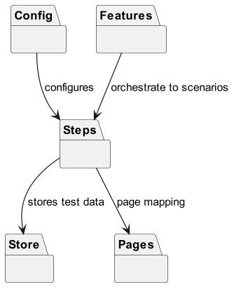
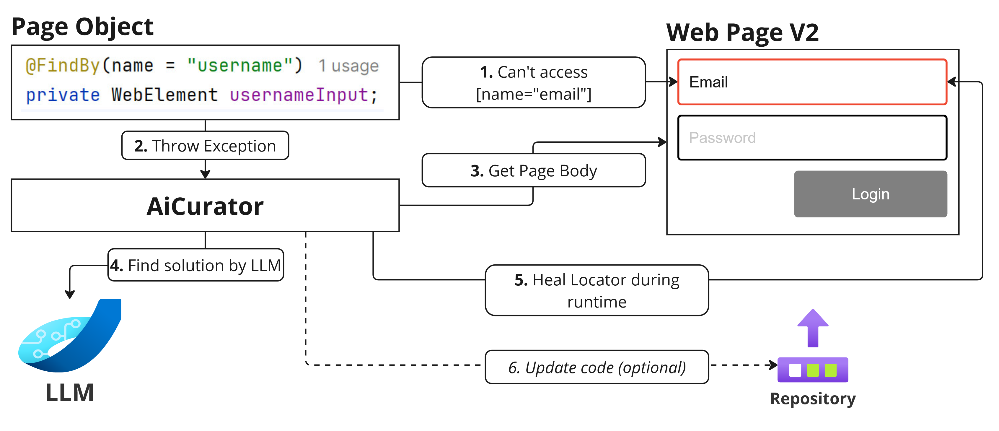

This project compares the Selenium self Healing approach of Healenium with the AI-based approach of AICurator. The
comparison is based on a sample web application that requires healing for different versions of the frontend page. The
healing process is repeatable, allowing AICurator and Healenium to be compared.

# Setup

To use AICurator, you need one of the following:

1. **Claude 3 Key**: Set the environment variable
   `export ANTHROPIC_KEY=your_claude_3_key`.
2. **ChatGPT Key**: Set the environment variable
   `export OPENAI_KEY=your_chatgpt_key`.
3. **Local Mixtral Instance**: Start Mixtral via **LM-Studio** before running
   AICurator.

AICurator uses **Claude 3** by default.
Changing Default: `spring.active.profile=<llm>` to `claude3`,`chatgpt`, or `local` during for test run.
Alternatively, modify `ChatClientConfig.java`.

## Run the Demo Web Application

Start the backend by running the `TaxiApplication` class.
Start the frontend by running `npm start` in the `frontend` directory.

Or just run the `docker-compose up` command in the root directory.

## Run the Self-Healing Integration Tests

Run `RunAll` to execute the tests. The tests will run with AICurator by default.
To run the tests with Healenium, set `spring.active.profile=healenium`.

# Design of the project

## Design Demo Web Application

The web application allows users to share a taxi for a specific route, simulating processes like determining the route,
validating it, and calculating prices for reservations. The cost of a reservation decreases as more users join the ride,
and users get updates when the cost changes. The login and registration functionalities are fully implemented.
The application follows a single-page application (SPA) architecture for the frontend and a RESTful backend. The
frontend is built using React and Bootstrap, while the backend is developed using Spring Boot and includes an OAuth
server for login.

## Design Self-Healing Integration Tests

The tests were created using Cucumber and are divided into steps and pages. The Cucumber features describe the expected
behavior of the application. The steps contain the code to interact with the pages, create test data using the API, and
maintain the context. The pages contain the locators and methods to interact with the web elements. Runtime healing
occurs within the pages.

### AICurator

AICurator shares the same primary objective as Healenium: healing locators at runtime. When a locator cannot be found,
the Selenium exception is caught, and the healing process is initiated. Information for the prompt is collected,
including the failed locator, the body of the current HTML page, the PageObject code, and the called methods from the
test code. This extended context allows the LLM to generate a pull request for the repaired test code.

#### Step-by-Step Example

1. **Can't Access \#email**: The test execution starts, but the web page throws an error because it cannot access the
   element identified by \#email.
2. **Catch Exception**: The exception is caught in the code.
3. **Get Page Body**: AICurator retrieves the body of the web page.
4. **Get Further Context**: AICurator gets the PageObject code and the called methods from the test code.
5. **Find Solution by LLM**: AICurator consults the LLM to find a solution based on the page body and the error.
6. **Heal During Runtime**: AICurator applies the solution found by the LLM in real time.
7. **Pull Request (optional)**: After successful healing, AICurator sends an event with the updated test code, which can
   be used to create a pull request.

# Paper

My research on self-healing in Selenium Automation can be found here: [Self-Healing in Selenium Automation_Daniel_Keiss.pdf](paper/Self-Healing%20in%20Selenium%20Automation_Daniel_Keiss.pdf).